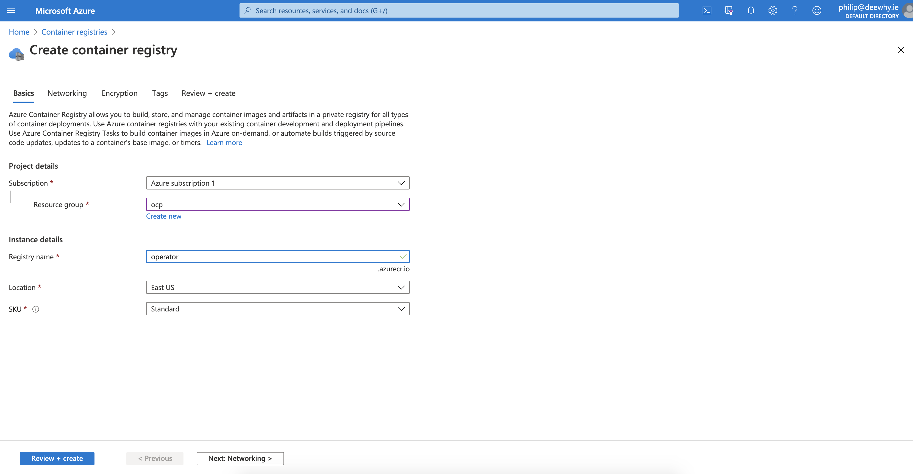
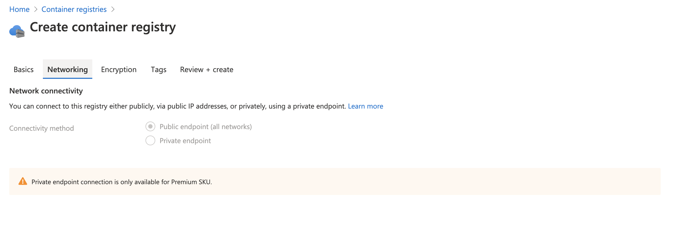
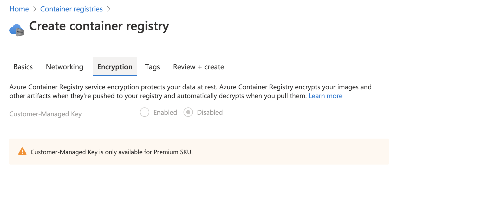
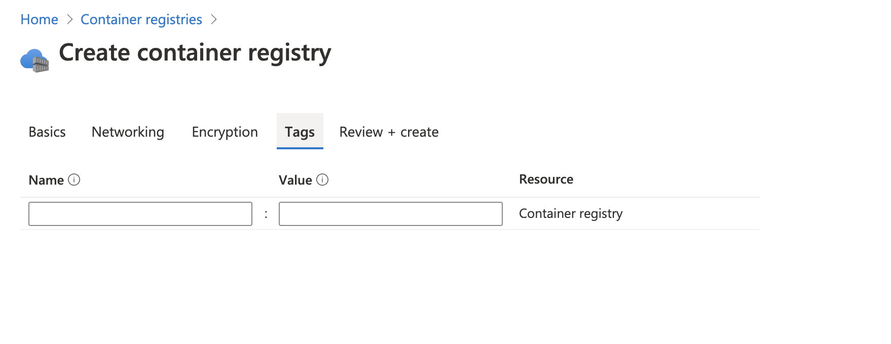
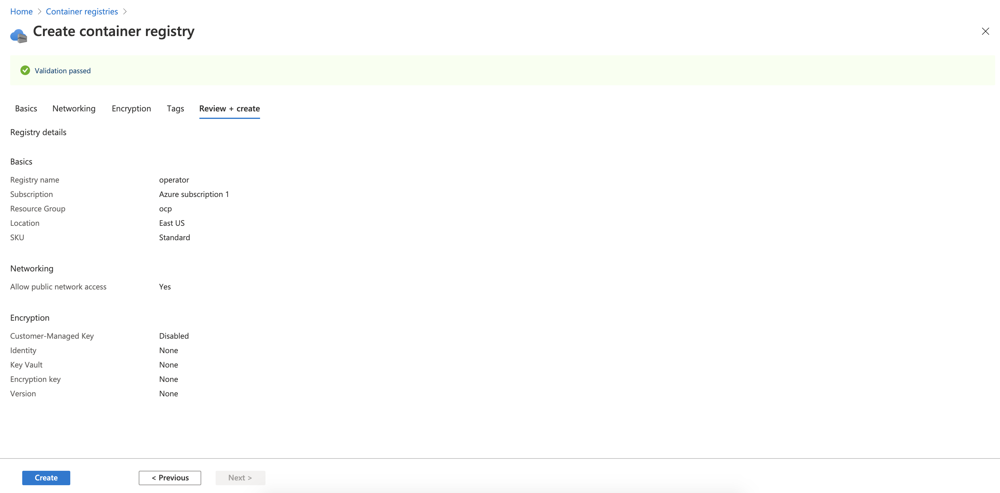
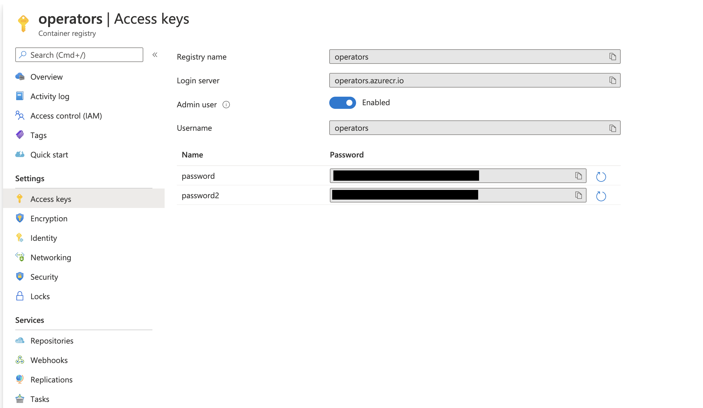
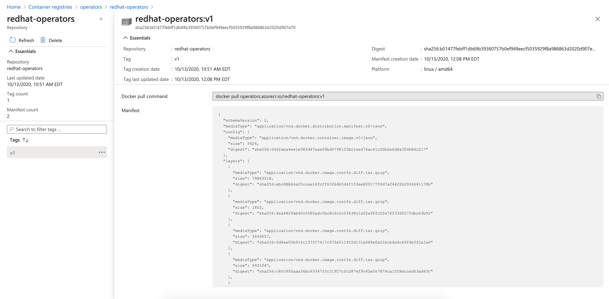
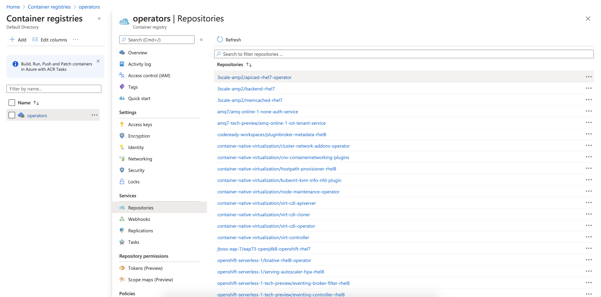
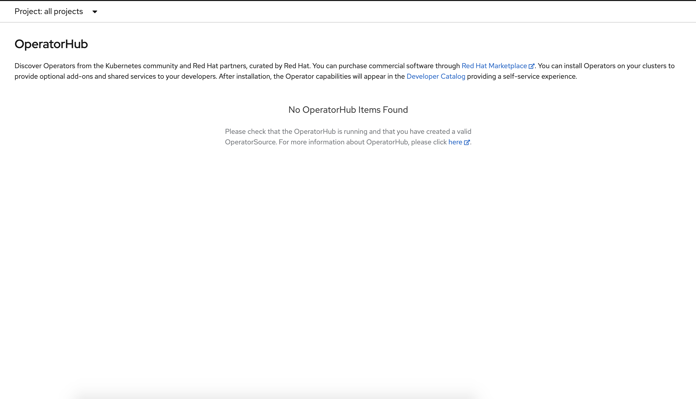
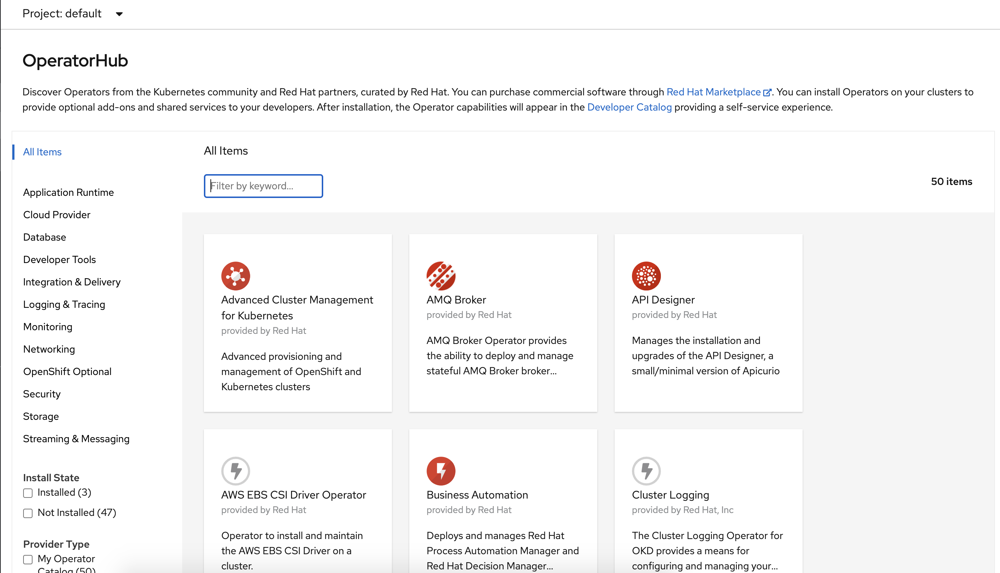

## Azure container registry setup and login

Create a container registry in Azure.

In my example, I already have resource group created called "ocp"



Select the resource group, and enter a registry name.  Click on "Next, Networking" to move to the networking tab.



My subscription only allows for public endpoints, so I'm going with the default.  Click on "Next, Encryption" to move to the encryption tab.



Again, as I'm on a standard subscription, I don't have any options around encyption.  Click on "Next, tags" to move to the tags tab.



I don't need to use tags for this PoC, so I can leave these empty.  Click on "Next, Review and Create" to create the registry.



You should see "Validation passed", click on "Create" to create the registry.

Once the registry is created, we need to create some credentials.

In my case, I'm going to use an admin login.  Navigate to your container registry and select "Access Keys"



From the access keys page, switch "Admin user" to enabled, and take note of the login server, username and one of the password options.

Use this information to login using podman, e.g.

`podman login operators.azurecr.io`

Enter the username and password copied from the previous step.

## Red Hat registry login

Login to registry.redhat.io with podman:

`podman login registry.redhat.io`  

Once you are logged in you should see your podman credentials in `/run/containers/0/auth.json`

e.g.

```
{
        "auths": {
                "operators.azurecr.io": {
                        "auth": "xxxxxxxxxxxx"
                },
                "registry.redhat.io": {
                        "auth": "xxxxxxxxxxx"
                }
        }
}
```

We will use this file as authentication for our catalog builds.

## Create an operator catalog image.

Now that we have our container registries setup, we can create an operator image and push this to the Azure registry.  To do this use the command:


```
oc adm catalog build \
    --appregistry-org=redhat-operators  \
    --from=quay.io/hayesphilip/ose-operator-registry:4.5  \
    --filter-by-os="linux/amd64"  \
    --to=operators.azurecr.io/redhat-operators:v1  \
    --insecure=true   \
    -a /run/containers/0/auth.json

```

Once this catalog build is complete, you should see a redhat-operators repository in Azure, e.g.



## Mirror the catalog

Once we have our catalog build image, we now need to mirror the catalog images.  To do this, enter the following:

```
oc adm catalog mirror \
    quay.io/hayesphilip/redhat-operators:v1 \
    operators.azurecr.io \
    --filter-by-os="linux/amd64" \
    --manifests-only="false" \
    -a /run/containers/0/auth.json
```

This process will take a long time, as it's progressing you will see output e.g.

```
uploading: operators.azurecr.io/openshift-serverless-1-tech-preview/ingress-rhel8-operator sha256:0a63a759fe257f3dd27febd6fd31ce343810bd64bf8bdff07c142eff05ac91fc 33.07MiB
uploading: operators.azurecr.io/openshift-serverless-1-tech-preview/ingress-rhel8-operator sha256:64e9f44a6696da357733888d0e1bb78d59fc13b30e42a82109fdc0a20aee8c9f 15.79MiB
sha256:30dba41e4b867f25d488a1fb268dfc8f9a60478315a7941b419d9db11586a342 operators.azurecr.io/openshift-serverless-1-tech-preview/ingress-rhel8-operator
sha256:7a4bc02286133125cb9a625ec574a149516af5e38164fbbd57701627fb9601d6 operators.azurecr.io/openshift-serverless-1-tech-preview/ingress-rhel8-operator:3176cc93
info: Mirroring completed in 30.49s (1.68MB/s)
```

When you look at the Azure container registry, you will see the image repositories being created.



Once this process is finished, we can now deploy our catalog image and updated image locations.

# Deploy custom catalog image.

First step is to disable the default catalogs.  To do this enter the following command:

`oc patch OperatorHub cluster --type json \
    -p '[{"op": "add", "path": "/spec/disableAllDefaultSources", "value": true}]'`

If you take a look at Operator Hub, you should see something like:



Take a look at ./redhat-operators-manifests/imageContentSourcePolicy.yaml

You will see the configuration of mirrors e.g.

```
  - mirrors:
    - operators.azurecr.io/openshift4/ose-logging-kibana5
    source: registry.redhat.io/openshift4/ose-logging-kibana5
```

We can apply this by running:

`oc apply -f ./redhat-operators-manifests/imageContentSourcePolicy.yaml`

Finally, we can deploy our image, with the following:

```
apiVersion: operators.coreos.com/v1alpha1
kind: CatalogSource
metadata:
  name: my-operator-catalog
  namespace: openshift-marketplace
spec:
  sourceType: grpc
  image: operators.azurecr.io/redhat-operators:v1
  displayName: My Operator Catalog
  publisher: grpc
  ```

To apply this run `oc apply -f catalogSource.yml`

Check the Operator Hub again, you should now see it populated with operator catalogs e.g.



It should now be possible to deploy and use these operators using images from the Azure container registry mirror.